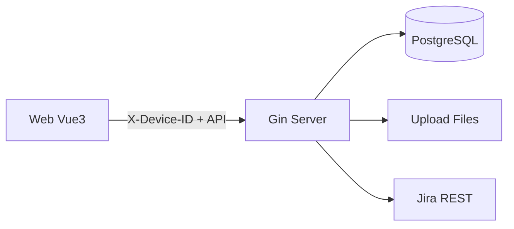

# 车机日志分析系统

根据 `todo.md` 拆分为两个子项目：

| 目录 | 技术栈 | 说明 |
|------|--------|------|
| [server](./server) | Go, Gin, PostgreSQL | 上传、入库、查询、Jira 同步 |
| [web](./web) | Vue 3, Vite, Element Plus | 设备标识、上传、搜索、场景、日志展示 |

## 快速开始

1. 创建 PostgreSQL 数据库 `log_tools`，配置 `server/config/config.yaml`
2. 启动服务端：`cd server && go run .`
3. 启动前端：`cd web && npm install && npm run dev`
4. 浏览器打开 http://localhost:5173

## 架构示意

